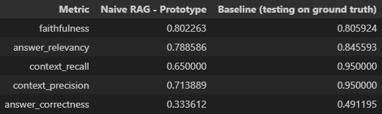
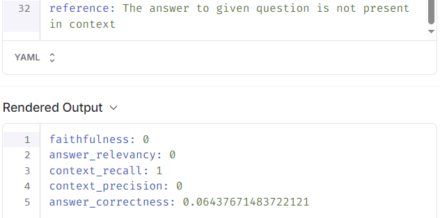
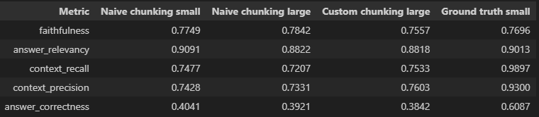

# Midterm project report

This is a report for the AIM AI Engineering Bootcamp Cohort 4 Midterm project

## Task 1: Dealing with the Data

For the task I have chosen the "National Institute of Standards and Technology (NIST) Artificial Intelligent Risk Management Framework". I found it more challenging and interesting due to its complex inner structure that contains multiple tables.

### Potential questions

First, let's make a list of potential questions people could ask of this document. For this task I will use the smartest model available to me, GPT-4o, and let it make a list of potential questions with answers.

Here is a sneak-peak:
- What is the purpose of the NIST AI 600-1 publication?
- What are some of the risks unique to or exacerbated by GAI as outlined in the document?
- What is the role of the U.S. AI Safety Institute established by NIST?
- What is the significance of the AI RMF profiles?
- What steps should an organization take to ensure the transparency of training data and generated data for GAI applications?
- What factors should be considered when updating or defining risk tiers for GAI?
- How should organizations handle the periodic review of content provenance and incident monitoring for GAI systems?

We can see there is a mixture of document specific questions, general questions relating to (G)AI, and most importantly the last three questions are very specific and the answers to the are contained in tables. This create another level of sophistication because we would prefer tables extracted as single chunk to preserve semantic meaning.

### The default chunking strategy

We can already forsee that a naive character based or token based strategy may not be enough to tackle questions, especially contained in a table. Moreover, a more robust OCR approach is required to preserve the original structure of the document (especially tables). For the quick end-to-end prototype we can use a naive pdf OCR appoach combined with a naive token based text splitter.

### The chunking strategies I would like to test

I would like to implement OCR that is able to produce output in structured formats. The two approaches are:
- Simple `RecursiveCharacterTextSplitter` with PyMyPDF OCR. The advantage is that it is simple and cheap and gives you the baseline data for comparison.
- LaTeX OCR output with a custom chunking function. Here is where I try to create a custom chunking function that can extract tables from the document as a whole, hopefully, preserving semantic meaning continuity and increasing quality and accuracy of RAG.

### The chunking strategy decision making

There are several reason for implementing such approach:
- Complex structure of the document that contains tables. For instance, novels usually do not contain tables and a simple recursive character or token splitting is most often good enough.
- The document has well defined heading which makes it easier to perform semantic chunking. We could implement HTML chunking, however, I believe Markdown format is neater as it is more compact.
- LaTeX OCR and custom chunking is required to extract tables more precisely. LaTeX format is preferred over Markdown as it has special tags that define a start and the end of a table. It is a difficult endeavour, so I will try to do my best. 

## Task 2: Building a Quick End-to-End Prototype

### Prototype walkthrough

Please see my walkthrough by following the [link](https://www.loom.com/share/543ccfa1e3d444da88a38bbe6d19cec1?sid=66e51eaa-9352-40a5-af1a-712b552757a1).

### The motivation behind the stack

These are the following reason why I chose this stack:
- Since a prototype is a essentially a PoC (Proof-of-Concept), therefore, it is more important to build something quick with the available tools. The best way is to reuse what has already been provided to us.
- Qdrant vector DB is chosen for its lightweight, in-memmory feature, easy deployment and LangChain integration, and a recommended DB by AIM.
- Gradio was chosen for UI because of it is easy to build a UI with; it is used by Hugging Face, it has chatbot interface deployable with a couple of lines of code, I have some experience with it (more than with Chainlit).
- LangChain choice is obvious
- GPT-4o model is chosen for its reasoning capability and tempreature lowered to zero to minimize hallucinations.
- OpenAI small embedding model chosen for its speed, relatively high accuracy, and low price.

## Task 3: Creating a Golden Test Data Set

Please see the code in the [notebook](midterm_project_workbook.ipynb)
The golden dataset saved as testset.csv and can be found [here]()

### Assessing the pipeline with RAGAS

I have tested a "naive" RAG pipeline, the same used in the prototype I shared above, against the test set itself.
I was interested to see what result I can get if I supply the question and the relevant ground truth (instead of chunks) to RAGAS evaluation. The findings are interesting and buffling:

**Comments:**
- Surprisingly, the basic RAG approach shows pretty good results in faithfulness and answer relevancy. However, as expected, context recall and precision are lower. This is expected due to a simpler chunking strategy and standard (not fine-tuned) embedding model.
- The answer correctness metric is very low for the naive RAG pipeline. This must have to do with the low scores on context recall and precision.
- The more surprising results are when we run the RAG chain on the test dataset itself. I kept the same LCEL RAG pipeline and injected context from the SDG test dataset. So the only difference between the two approaches is the context that is supplied.
- Very much expectedly, Baseline had high context recall and precision. However, not 100% which is very interesting. I did a follow-up investigation into it, please see comments below.
- Baseline answer correctness, though higher than the Naive RAG, still is less than 50% which appears to be very low.
- Every time the evaluation is run, you get sligtly different results. This is due to undeterministic nature of Large Language Models. However, this complicates the task of objectively assessing your pipeline.
- After an investigation into how RAGAS works (what prompts are used), it became very evident that the whole process intoduces a lot of variance and bias due to the undeterministic nature of LLMs. First, it starts from SDG. My syntetic dataset had two test questions which had context irrelevant to the question and the groundtruth answer was "*The answer to given question is not present in context*". Either this was made on purpose to test that the LLM does not hallucinate or it is a mistake, it produces innacurate results like low values for the metrics:

- The bias and variation keeps propagating through the RAGAS pipeline as LLMs are used to breakdown sentences, make decisions (define a sentence as TP, FN, etc.), etc. If you run the evaluation pipeline several times, you will get slightly different results. One of the way to account for it is to use multiple runs (say 30, according to Central Limit Theorem) for us to take a good sample of evaluation and being able to conlude about it's variability, mean/average metrics value, and its standard deviation. If we can see what the average metric for the RAG running on the ground truth and the correct context (golden dataset), then we are able to scale our result according to that. For instance, baseline test had answer correctness of 0.5 while the naive RAG had 0.33, when scaled the naive RAG correctness would be 66% which is not that bad.

## Task 4: Fine-Tuning Open-Source Embeddings

Please see the code in the [notebook](midterm_project_workbook.ipynb)

Link to the fine-tuned embedding model: [click here](https://huggingface.co/Mr-Cool/midterm-finetuned-embedding/commit/927d0ef0bbf81c223d936e1dd95819a30a0c7416)

### Model choice

I fine-tuned `snowflake-arctic-embed-m` as it is small enough to fit in GPU memory on my laptop.
The original `snowflake-arctic-embed-m` model was able to achieve 62% retrieval accuracy, while the fine-tuned one maxed out at 100%.
For comparison, I ran the test with `text-embedding-3-small` and `text-embedding-3-large` which achieved 96.5% and 100% accuracy accordingly.

| Model                        | Accuracy          |
|------------------------------|-------------------|
| snowflake-arctic-embed-m     | 62% (original)    |
| snowflake-arctic-embed-m     | 100% (fine-tuned) |
| text-embedding-3-small       | 96.5%             |
| text-embedding-3-large       | 100%              |

For the mid-term project I have chosen `text-embedding-3-large` model. Let's imagine I was doing the project for my boss and here is my motivation:
1. OpenAI models served via Azure OpenAI APIs are standard stack for our company. Given that the large model achieves 100% accuracy, it makes sense to use it from performance point of view.
2. Development of the solution is faster as I do not have to solve the problem of serving the fine-tuned embedding model.
3. `text-embedding-3-large` is cheaper for our usage case is we can pay by tokens, while the fine-tuned model deployed in Azure using a GPU VM would cost per hour. The cost would be significant.

## Task 5: Assessing Performance

### Fine-tuned model vs `text-embedding-3-small`

Though looking at the table above we may conclude that faithfulness, context precision, and answer correctness metrics have improved, however, we must treat these results with caution. Due to forementioned undeterministic nature of LLMs, we have high variability in our measurements. Thanks to William Sealy Gosset and Guiness beer we now have a powerful Student's *t*-test (please read the story on [Wikipedia](https://en.wikipedia.org/wiki/Student%27s_t-test)). The Student's *t*-test showed that we cannot conclude that there is any difference in the true means of all metrics for the RAG pipeline using the small embedding model vs a fine-tuned model. Except context recall for which we can conlude with 95% confidence that the means are different.
Therefore, though we can conclude that the fine-tuned embedding model increased the context recall, however, there was no provable effect on all other metrics.

### `RecursiveCharacterTextSplitter` token-based chunking vs custom chunking

Here we come to the most interesting part.

I have implemented custom chunking based on converting the original pdf to LaTeX and extracting chunks semantically. 
**NB**. Please note that the chunking algorithm has been removed from the notebook due to confidentiality and IP restrictions.

**Comments**:
- The results are quite frustrating for me. My chunking algorithm has not showed any improvement at all. The results are within the margings of error and there are not significant difference compared to the 'naive' chunking strategy.
- Moreover, converting pdf to LaTeX to improve table readability for the GPT-4 model, has not brought any advantages.
- The most primitive OCR with PyMyPDF combined with 'naive' chunking strategy delivers the same result. On the other hand, it is good news as we do not require more complicated solution in this case.
- The interesting comparison here is with the ground truth dataset. For the comparison, I kept the RAG prompt exactly the same. The difference is ONLY in the context supplied.
- Ground truth achieves improvement on context recall and precision (not unexpected, huh?). However, please note that the numbers are not 100%. Again, it points to inherent variability of measurement.
- Not surpsingly, the answer correctness increased significantly but again only reaching 61%. This would be our benchmark. It actually shows how good can the RAG pipeline get given this dataset.
- The two metrics that have not experienced any change are faithfulness and answer relevancy. This is also somewhat expected as we are using exactly the same RAG prompt. To make difference, we would need to create a more relevant prompt (should we try DSPy?).
- One of the reasons why correctness numbers are low for the two pipelines could be attributed to 40% share of multi-context questions. The retrieval part most probably fails to extract all relevant chunks. This is something that requires further research.

### Which one is the best to test with internal stakeholders next week, and why?

Based on the discussion above:
The best approach would be to use PyMyPDF for OCR, `RecursiveCharacterTextSplitter` chunking strategy, `text-embedding-3-small` embedding model, and GPT-4o model to test with our internal stakeholders. This approach is the most simple to implement, requires minimal computational resources, quick to deploy, and most importantly it is cheap. The method has demonstrated that there are no difference in it's performance compared to using fine-tuned embedding model, custom chunking strategy, or more expensive `text-embedding-3-large` embedding model.

## Task 6: Managing Your Boss and User Expectations

### What is the story that you will give to the CEO to tell the whole company at the launch next month?

**Empowering Our Team with Cutting-Edge AI Technology**

We are thrilled to announce the launch of our new AI-powered assistant, a tool designed to revolutionize the way we access and interact with complex internal documents and policies. This assistant leverages advanced AI language models to provide quick, accurate, and context-rich answers to your questions about vital documents like the National Institute of Standards and Technology (NIST) Artificial Intelligence Risk Management Framework.

**Bridging Knowledge Gaps**

Our organization deals with intricate policies and extensive documentation that are crucial to our operations and compliance. Navigating these resources can be time-consuming and challenging. With our new AI assistant, you can now obtain clear and concise answers in seconds, allowing you to focus on what you do best.

**Behind the Scenes**

Our dedicated AI Solutions Engineering team has meticulously developed this assistant over the past months. They tackled complex challenges, such as interpreting elaborate tables and preserving the nuanced meaning of our documents. By optimizing how the AI processes and understands our materials, they've ensured that you receive reliable information whenever you need it.

**Join Us in This Journey**

We invite all employees to engage with the AI assistant and explore its capabilities. Training sessions and support resources will be available to help you get started. Together, we'll pave the way for a more efficient and innovative future.

### How might you incorporate relevant white-house briefing information into future versions? 

1. Establish continuous update pipeline. The pipeline takes new documents, chunks and vectorize them, and populates the database.
2. An algorithm that checks the new incoming documents (or chunks) for similiarity to those already present in the database to prevent from duplicating data. Since we have a limit on the number of retrived documents, duplicated or similar documents take up space and do not allow for more relevant chunks to be extracted.
3. Update the test dataset with questions based on the incoming document(s) and retest the pipeline.
4. Implement user feedback collection and continuous improvement of the solution.
5. Make sure we have scalable infrastructure that can handle more data and higher loads (user requests).
6. Ensure correct and robust error handling especially while data ingestion to make sure no data is missing or corrupted.
7. Make sure that the solution is compliant with any legal and ethical standards. Does not violate copyright, safe and stable.

# The End